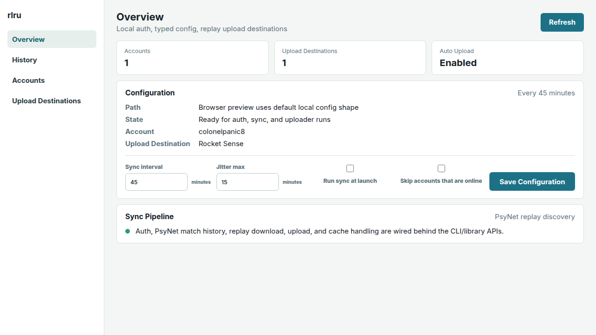
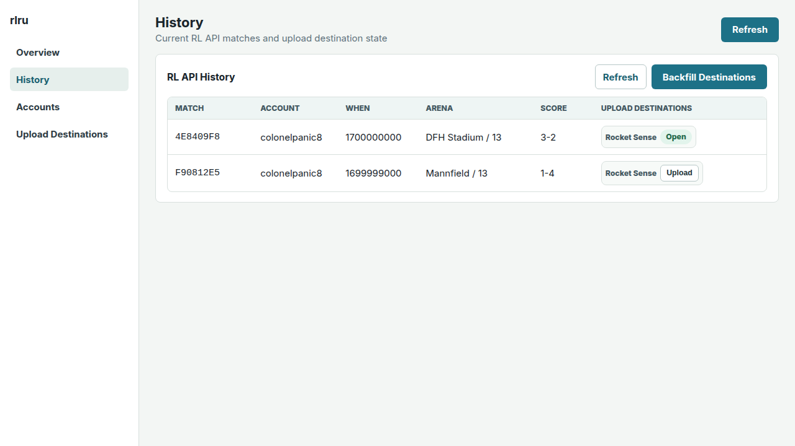
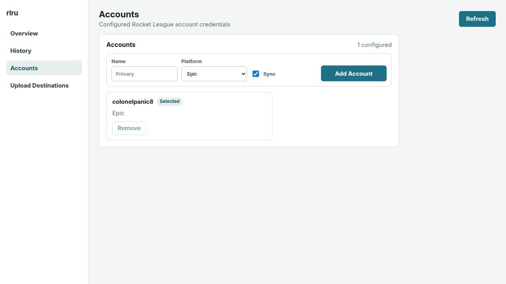
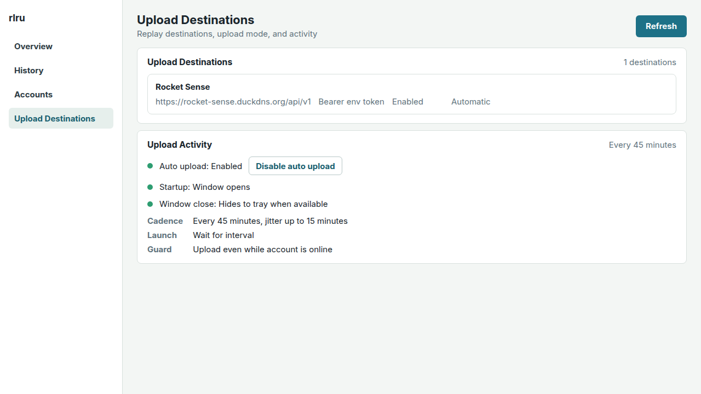

# rlru

Rust-first Rocket League replay uploader.

rlru uses strict TOML configuration, explicit local state paths, testable
auth/upload boundaries, and a Dioxus client scaffold.

## Screenshots









## Development

```bash
direnv allow
just check
just run -- --help
just dioxus-desktop
```

## Releases

GitHub releases are published when a `vX.Y.Z` tag matching the `rlru` Cargo
package version is pushed. To cut a release from a clean `main` checkout:

```bash
just release-tag
```

The release workflow uploads downloadable assets to the GitHub Releases page:

- `rlru-cli-linux-x86_64.tar.gz`
- `rlru-cli-windows-x86_64.zip`
- `rlru-dioxus-linux-x86_64.AppImage`

If the `CARGO_REGISTRY_TOKEN` repository secret is configured, the same tag run
also publishes the crates to crates.io. GitHub release assets are still created
when that secret is absent.

## Windows Builds From Linux

The dev shell includes the Fenix `x86_64-pc-windows-gnu` Rust target and the
MinGW linker toolchain. Build Windows executables from Linux with:

```bash
just windows-cli release
just windows-dioxus release
```

The CLI executable lands under
`target/x86_64-pc-windows-gnu/release/rlru.exe`. The Dioxus desktop executable
lands under `target/x86_64-pc-windows-gnu/release/rlru-dioxus.exe`, with
`WebView2Loader.dll` copied beside it.

## Configuration

Print the effective default configuration:

```bash
rlru config defaults
```

Validate a configuration file:

```bash
rlru --config ~/.config/rlru/config.toml config validate
```

Tokens are stored separately from TOML config under the XDG config directory.

The default upload destinations include Rocky, Ballchasing, and Rocket Sense at
`https://rocket-sense.duckdns.org/api/v1`. For Rocket Sense uploads, set
`ROCKET_SENSE_TOKEN` to a Rocket Sense bearer token before running `rlru sync`,
or configure a command that prints the token to stdout:

```toml
[storage.auth]
kind = "bearer_command"
command = ["pass", "show", "rocket-sense/token"]
```
